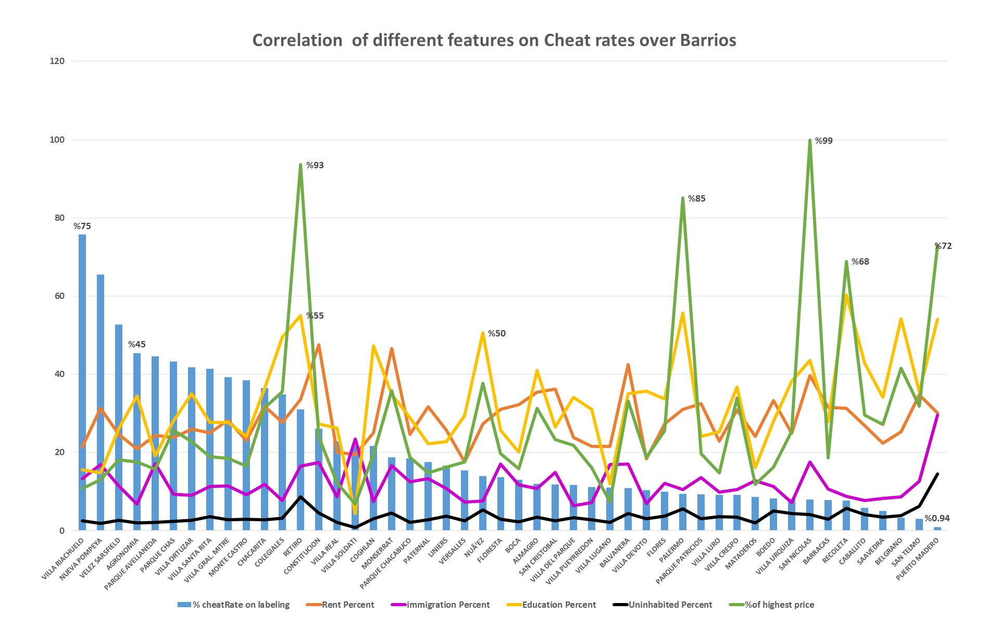
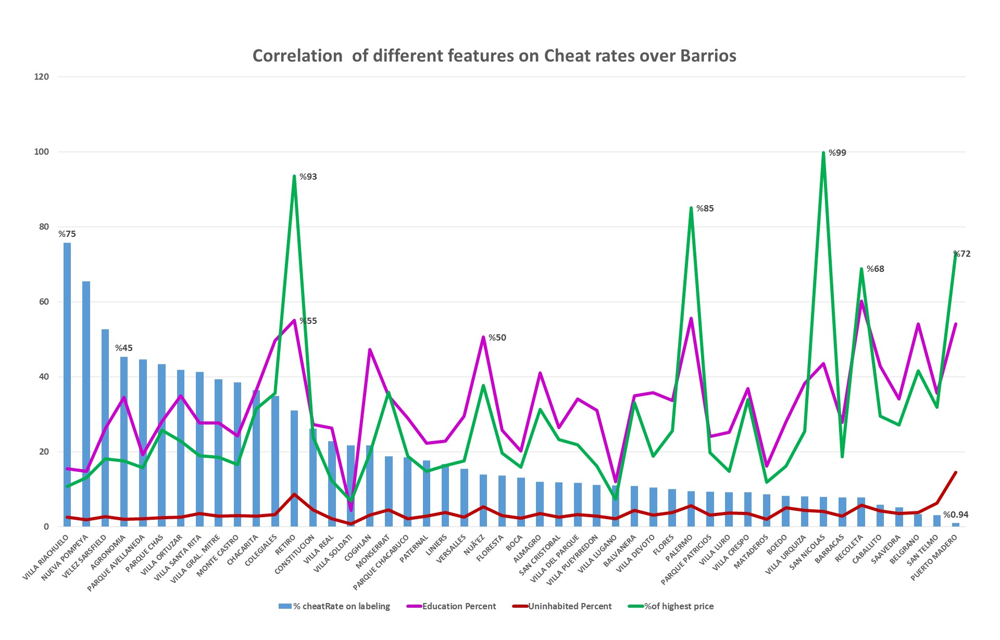
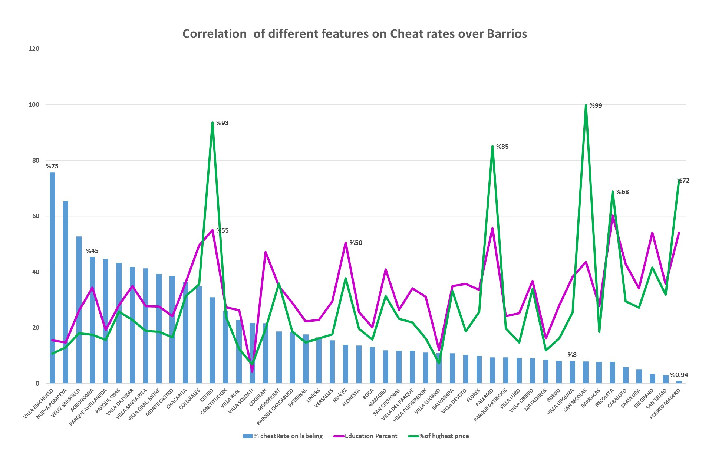

# analysis

### Introduction

The analysis section is based using the merged data from three different sources including Properati open dataset, city of Buenos Aires dataset, and census. The merged data puts a wide range of features suitable for conducting unique analysis at individual home level. The analysis has three sections:

1. Feature selection
2. Mislabeled homes: homes that have been mislabeled by sellers
3. Price gap: the gap between the advertised price and the final price

### Feature selection:

- `MIR_Feature_Selection_Results` is a directory containing Mutual Info Regression feature selection for each year. The yearly directories contain csv files of ranked features with their respective scores for each barrio. File names are in the format: 
```
<year>_<barrio id>_rankedFeatures.csv
```


- `barrio_feat_select.py` generated the csv files in MIR_Feature_Selection Results using the final file csv with all merged data. [authored by Breanna]

- `price_pred.py` generated the file for price gap prediction, or rather, ranked features by importance in driving the price gap on a yearly basis. Results are of the format: 

```
<year>_rankedFeatures_gapPred.csv. 
```
- Files of the format: 
```
<year>_gap_feat_influence
```
 are based from the price gap prediction feature selection results. Rather than scores, features are assigned a percentage of influence based on the scores. 

### Mislabeled homes:
This section includes correlation analysis on mislabeled homes at the barrio level. The purpose of this analysis is to show what features cause higher mislabeling rate at the barrio level. Sellers might mislabel their barrio name by purpose or mistake, but our analysis reveals interesting findings about sellers' behaviour. 

In this process, we had some challenges, for example, some people mispelled the same barrio names with different pronounciation such as "NUÑEZ" or "NUNEZ", or diffrent style like "VILLA GRAL. MITRE" and "Villa General Mitre". 

Fnally we computed the Mislabelling percentage over different Barrios, and we analyzed the correlation between this rate with average of other features over barrios. the result is shown in the graph below:



As seen in the graph, the correlation of Education and uninhabited percent and the percentage of highest price were more significant equal to -0.33 see graphs below:




This means that, in general when the barrio's percentage of educated residents, price per m<sup>2</sup> and Unhinhabited rate is higher, we  expect that rate of mislabeling will decrease. 

_"Percentage of highest price"_ for each barrio means:

 $$\frac{average\: price\:  per\:  m^2\:  for\:  a\:  barrio}{highest\:  average\:  price\:  per\:  m^2\:  between\:  all\:  barrios} * 100$$


We also observed that features of "Computer Percent" and "Education Percent" has high positive correlation with each other with value 0.85, it means when a barrio has a higher education level we can expect higher rate of computer usage which is make sense. 
As you can see in seen in the graph:

(PriceEducation_Analys_pics.jpg) we also see significant positive correlation of features "Computer Percent" and "Education Percent" on "Percentage of highest price", Education correlation value on property price is 0.76 and correlation value for computer usage on property price is 0.47.


### Price gap:
This section covers some analysis on identifying how price gap changes across different barrios and different years. This is a unique dataset that has been created by matching longitude/latitude of homes in Properati and the city of Buenos Aires datasets.

 The price gap analysis enabled us to see how the price gap in some barrios is higher than the others. Some preliminary findings are:
- Affluent neighbourhoods in Northeast Buenos Aires (Palermo, Retiro, etc.) has larger gap than South (Liniers, Nueva, etc.).
- The gap is higher for medium/less expensive houses than extra expensive ones
- The gap stays relatively the same from 2015-2018

